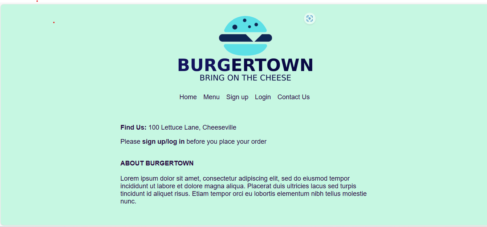
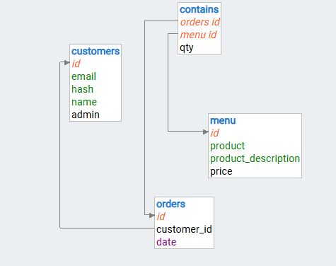
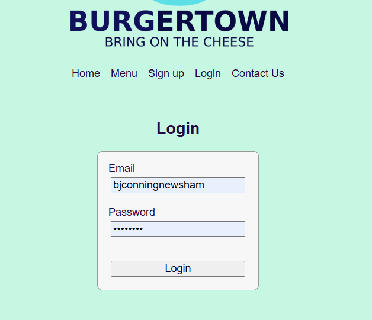
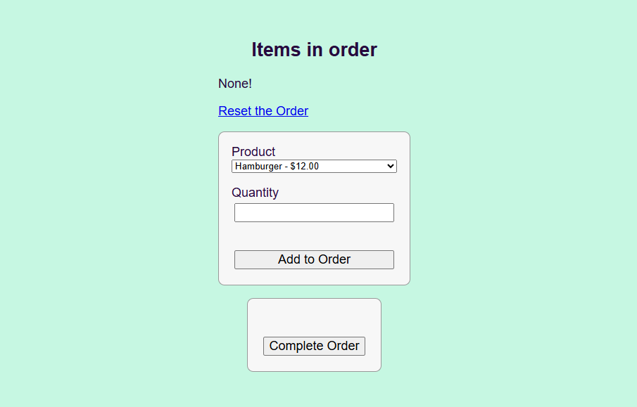
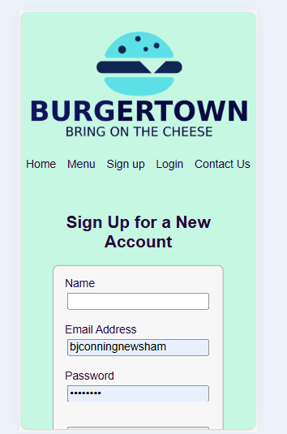
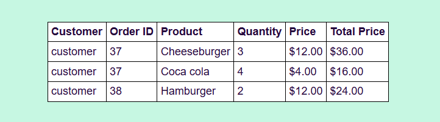
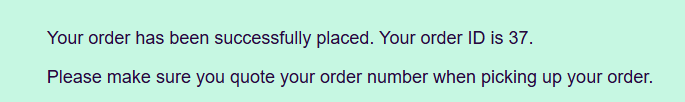
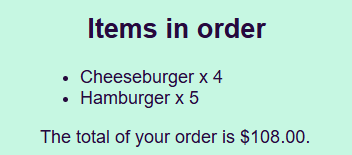
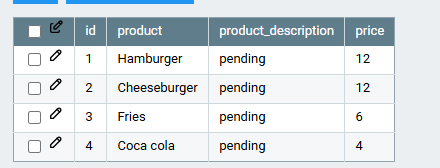

# Design of a Database-Driven Web Application for NCEA Level 3

Project Name: **Burger Town**

Project Author: **Brianna Conning-Newsham**

Assessment Standards: **91902** and **91903**

-------------------------------------------------

## System Requirements 
### Identified Need or Problem

Food ordering system required for local restaurant, with auto calculation of order and an order number provided so the customer can pick up their order from the store.

### End-User Requirements

- Must be quick and easy to navigate
- Clear and easy to read
- User needs to be able to create their own customer account and login and out with their password stored securely
- Have a personal feel once logged in
- User needs to be able to contact me with any questions if required
- Once order is made, confirmation of order needs to be displayed on screen
- Prices need to be able to be updated if required and new food items added
- No online payment is required as we only accept cash on delivery

### Proposed Solution

I build a website that suites the specific need of the end-user, this will include:
- The menu that is viewable without having to login.
- Clear and easy way for the customer to contact the store
- A login section
- An ordering system
- A way for the end-user to see how much they are spending
- A way for the owner to view the orders on the website

-------------------------------------------------

## Relevant Implications

### Usability

This implication means that the website I am making is usable.

To make the wevsite usable it needs to be able to do things that are required of it. Having things like auto calculation of orders so customers know how much they are speanding are apart of usability.

I need to consider every line of feedback from my end user, changing it constently to make sure it works and can be used.

### Functionality

This means that the website needs to work as intended.

If the website doesn't work as intended to than it is not a functining website. 

I will need to make sure that every thing works, so if I add something new than I need to make sure that it doesn't effect the other things in the code and make sure that I don't need to fix anything. I can also add things that help the website function better, like giving the menu the ability to add additional fields such as descriptions if the end-user desires.

### Future-Proofing 

This means that the website is protected from future impacts, like adding new things to the menu

If I add something to the menu I can't let the rest of the website break while doing it or have something break after I do it.

I need to consider the fact that I will be adding new things to the menu and I will be adding things to other databases.

-------------------------------------------------

## Relevant User Experience (UX) Principles

### Useful

Products and systems should be genuinely useful and fulfill a real need for a group of end-users.

If the website doesn't make it easy for clients to view a menu item, or if the site is in any way hard to use, then it is clearly not useful, and will frustrate users. Frustrated users won't bother using the system.

Right from the outset I will need to consult with the various groups of users to establish what they need from the system, and then make sure my design meets these needs.
I need to extensively test the system with all the users that will be using the system and gather feedback about their experiences.
Based on the feedback I can judge whether they find the system useful or not and alter the system accordingly

### Findable

Systems should be easily navigable, so end-users can find the content or functionality they need.

Since the users of the Burger Town website could have no IT skills at all, the system must be as simple to navigate as possible, with every function clearly findable. 

Non-technical users can find system frustrating to use when features are not clearly visible, or even hidden away (e.g. knowing that you have to swipe to delete something, rather than just having a delete button).
I need to make all navigation clear and easy to use, with no assumptions made about the abilities of the users.
The language used in the UI used must be clear and unambiguous so that there is no confusion over what any part of the system does

### Desirability

Desirability involves how well a feature or solution meets the needs and preferences of the end users. It’s about creating functionalities that users find useful, intuitive, and appealing.

I need to create a website that engages and satisfy users. Desirability ensures that features, interfaces, and functionalities are aligned with user preferences and needs, which enhances user engagement and satisfaction.

I will need to consider and implement all user feedback and other comments, for the most effective result in user desirability.

-------------------------------------------------

## Final System Design

### Database Structure

I don't have a screenshot of my intital structure but it did not include the 'contains' table. Just orders, customers & menu. I had to add this in later stages as I needed to connect the orders, the customers and the menu. The contains table joined together the orders with the menu and allowed me to keep track of eveything.

### User Interface Design

This is the final design of my web pages:

-------------------------------------------------

## Completed System

### Database Structure

This is the final database structure that I used:

### User Interface Design

This is how my website turned out:

-------------------------------------------------

## Review and Evaluation

### Meeting the Needs of the Users

The users needs have been meet as best as possible with the website design and fuctionality. Feedback from end user had been taken in and added, changes were made to adjust to the end users needs and requests.

I added one clear navigation tab with no scrolling required to make sure it is quick and easy to naviagate.
I used suitable fonts and colours to make it easy to read
I have made a way for the end-user to be able to make an acount and to be able to log in with that acount. I have also made it so that their passwords are hashed.
The user has accses to all they need as a customer while the admin has access to the orders.
I have made a page where the user has access to the owners number and to the establishment.
I have made it so that once the user has placed an order, an ID number would show up with the words, 'Order placed' to indicate that the order has been placed.
I have made it so that it is easy to add new menu items and to change the price of exsisting menu items.
I have not added a way for online payment as the end-user has requested.

### Meeting the System Requirements

I've meet all of the requirements that I stated at the start of the project to the fullest of my abilities and beyond. My website is easy to use for those with no knowledge of tech, it functions as intended and it is set up in a way that if anything goes wrong in the future it will be easily identifiable and fixable with debug options written into the code. I also made the layout responsive to phones.

Phone View:

### Review of Usability

I used every line of feedback from the end-user to make my website more usable to users who do not have a large amount of knowledge with tech. I also made sure that while also taking in the end-users feedback I was making sure that my website still worked as intended. I was changing the website constently, and made sure that it worked as well. In my opinion I have met all my goals and exspectations, I made the  website to the end-users liking to the best of my abilities. The design is simple, user friendly and consistent. There are no unnessary button clicks, order is auto calculated so the customer knows what they are receiving. The owner can see all the orders laid out in an easy to read table instead of in hard to read bullet points.

### Review of Funtionalitly

I kept testing the website with every new thing I added, to ensure that the code was not interfering with any old code. I tested everything once I added something, not just the code the new code was suposed to effect but all the code just incase the new code interfered with other code as well. In my opinion I have acheved this, all code works and nothing interfears with any code that its not suposed to effect.

I added a description field to the menu table which will allow the end user to easily add descriptions to their menu items if they wish.

I also achieved a functional site this by adding a function that gives the customer a unique order ID which allows them to pick up the food at the restaurant.

Order ID:

Customers are told the value of their order before the click 'complete' which is definitely important for functionality.

Customers can effectively login and log out and the website owner has full admin control.

Orders are logged through to the admin account with unique identifier so nothing is lost. I also hashed the passwords for user security.

All of the above makes the website fully functional.

### Review of Future Proofing

I made the website with the information of future planning in mind, like if I add something new to the menu. I have designed the website to be able to take the change of the databases, like if I add a new item to the menu or a new user, I have made the website to be able to not break if that happens. I have also made the website able to hold more data then what I originly thought it would hold, just in case more data is added then I thought. I can easily add things to my menu without anything breaking. I'm also able to change the prices of the items in my menu as they all in a separate table.

### Review of Findable

I have made easy labled buttons for the end-users, no scroll bars needed. These have all been placed on a navigation bar and change visability depending on if you are logged in or not, or if you are the account owner which makes it easy to navigate. I have named the tabs properly, with names that are simple and easy to understand. I have labled what every button will do with simple names that even the most inexpereienced person in technology would be able to understand. 

Before Login:

After Login:

### Review of Useful

Much like the Findable implication, I have laid out the look of the website to be simple and easy to navigate. I have made the website with the end-users in mind, so I made it plainly laid out, and not too large that I'd need more windows. I made the website to be as small as possible but also useful to the end-user. 

### Review of Desirability

I used all the end-users feedback on the look and function of the website to make as desirabile as possible. If the end-user said to change the colour to a darker blue to make it more nice, I would change it to make it more desirable to customers. I designed the website to be funny and quirky with a funny slogan to draw in end-users, making it more desirable. I use fonts and colours that are clear and easy to read. I also made the website to have as much of the end-users design ideas as possible, without making it too much for the website. If the end user had requested cursive fonts that were a similar colour to the background, I would have explained to them that this would make the website hard to read and use and would turn people away.

