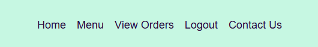

# Development of a Database-Driven Web Application for NCEA Level 3

Project Name: **Burger Town**

Project Author: **Brianna Conning-Newsham**

Assessment Standards: **91902** and **91903**

-------------------------------------------------

## Design, Development and Testing Log

### 30/04/24

I worked on the first page of the project

I wrote the first couple of lines of code to get the page up and running, I used old code to do this, I decised that I would use cool colours like a light blue, I changed the text colour to black, I let the enduser take a look and got a little bit of feedback about how it should be placed.

>User Request: I would like it if it were in the middle, like front and center

I changed the layout of the website per the endusers request and moved it to be more in the middle of the page where before it was left aligned.

### 5/05/24

I built the database and designed a logo for the website

I started with a basic database building it as I went, adding to it when I needed to, taking away what I didn't need, I also wrote code to put the users login data into the database to be used again when they login again. After that I started to design the logo for my website along with a slogan to make the page more interesting which is what the end user requested.

Logo design:

> User Request: Could you make the logging in look nicer, I also really like the logo and slogan, it's really funny, it matches perfectly and really makes it a website people will want to visit

I changed the look of the logging in sction and made it loook cleaner than before.

### 16/07/2024

Tested the login and sign up forms to see if they where still working as intended

The login is now working just fine but something is broken in the 'sign up' so now I need to find out whats wrong and fix it.

Before New acount:

Adding New acount:

After New acount:

> Replace this text with any user feedback / comments

I found out that my forms didn't match up and I quickly changed that and added more debug code that would tell me in advance if something was wrong. I also was able to make sign up form alot faster than before. It turned out that one of the fieldnames was wrong in my signup form and my do-signup was reading the wrong fieldname which meant it wasn't connecting to the database at all.

### 16/07/2024

I tested the visabilty of my website

I was making sure that when logged in, the login and sign up tabs are gone and was replaced with the logout tab, and I also made sure that the logout form was working as intended as well with these tabs designed to be visable once logged out.

Before Login:

After Login:

As you can see the visibility is working as expected.

So far there has been no new problems, the things I fixed seem to be stopping anything breaking again.

### 16/07/2024

I am making sure that all the data that I intend to go into the Database is going into the Database.

So far the Database is working as intended, all of the data I set to go into the Database is going into the Database in the correct places, and the other auto filling tables are filling with the corect data that they should be receiving.

DB before ordering:

Adding things to order:

Pushing the complete button:

Getting the message of the completed order:

DB after order sent:  

> Replace this text with any user feedback / comments

All the customer data is going into the correct tables in the Database. The sign ups they are going into the customers table and it is providing the info for when the user is logging in with their login, it is also taking the users orders once they push the 'complete order' button at the bottom of the list. The order is being added to the orders table with the unique orer ID and the menu is showing its contents and every thing is working correctly.

### 17/07/24

I made a menu page, a home page, and contact page

I mainly did a lot of writing for the pages, a little bit of coding here and there, to make the tabs for the pages work and for the tabs to show, I also wrote a little more for the ordering page. The end user can customize these pages with their final content once the site is released to them.

Menu page:

Home page:

Contact page:

### 18/07/24

I added a function that adds up the total of the users order. This is important for the end user for usability as it makes sure the customer knows how much they are going to spend before the click 'complete'.

I tested this by putting random things into the ordering list and seeing it add up the prices of the item of the things I was ordering and then I would do the math of the ordering to see if it was the same as what was showing on the screen.

Before Add up:

After Add up:

The adding was correct ($12 x 4 + $12 x 5) = $108 and I can add as many thing as I would like and the adding function works.

### 2/08/2024

I made an acount for an admin, and with this acount the admin can view all the customers orders on one page and they are able to make the orders.

It took a while to get working but I was able to get the acount to work and show a different page and not the ordering menu.

Logging in as the owner:

Admin page:

Admin view Orders:
